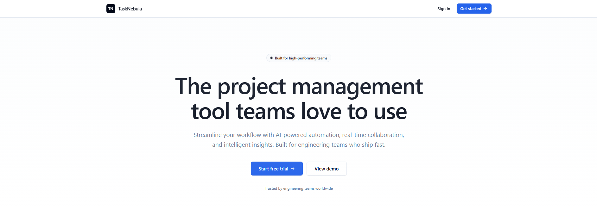
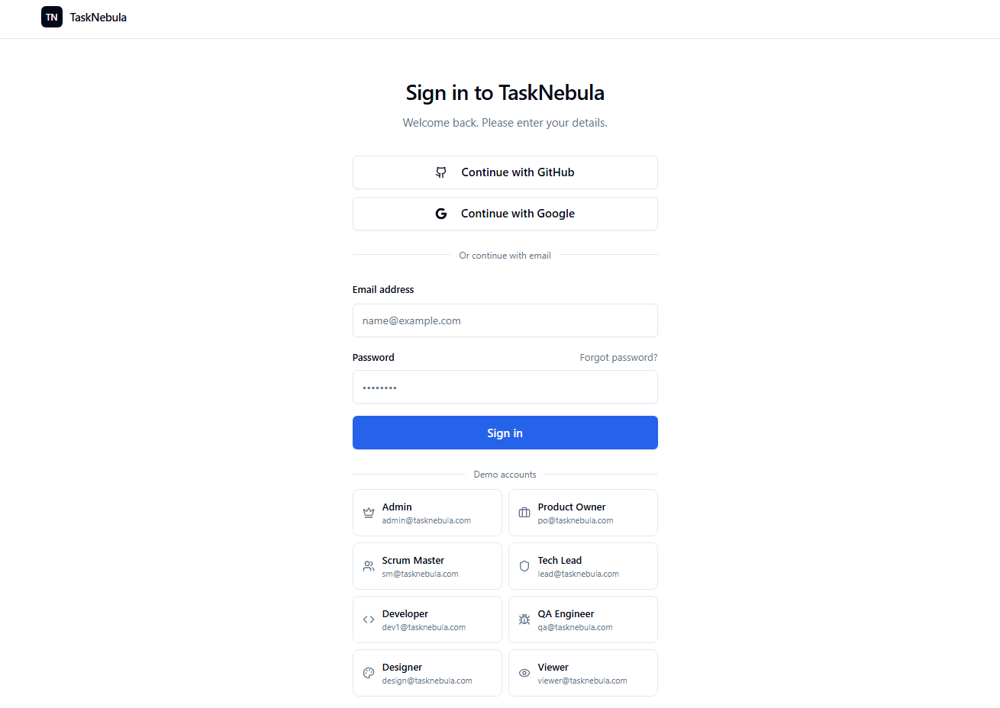
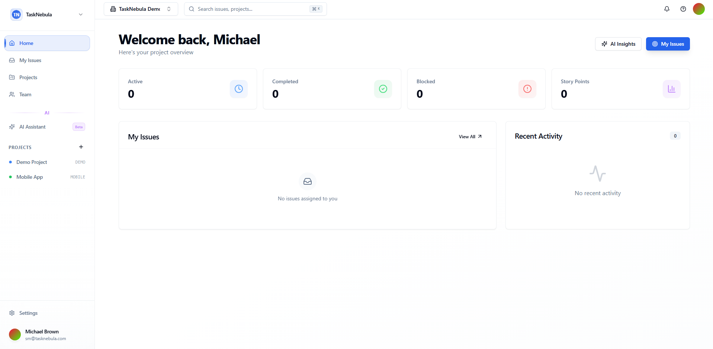
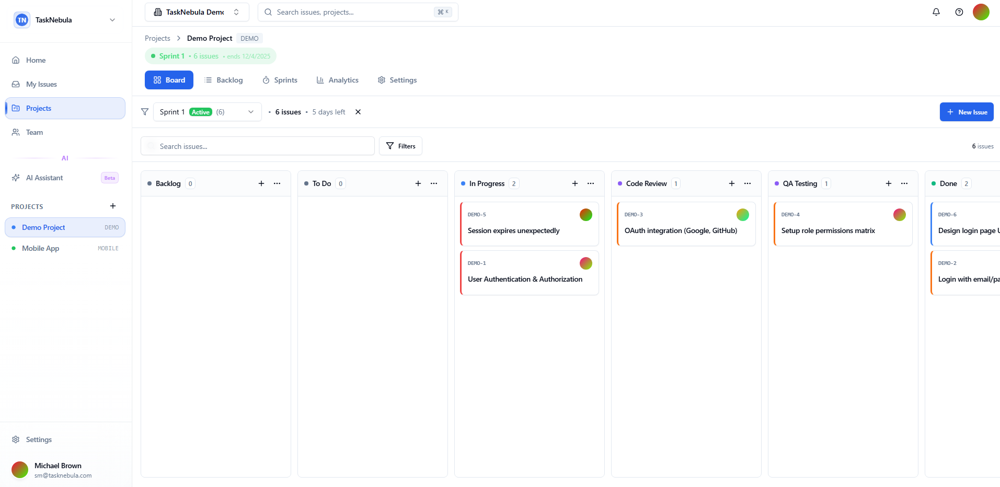
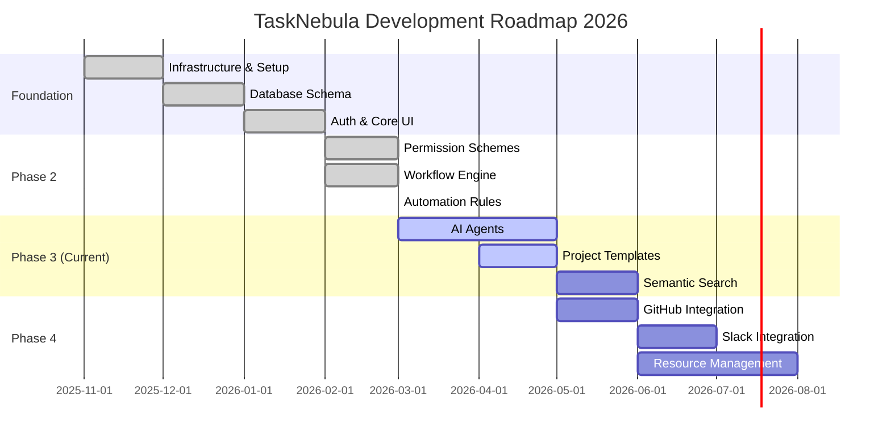

<div align="center">

# TaskNebula 🌌

### **AI-Native, Real-Time, Keyboard-First Project Management Platform**

[](https://hub.docker.com/r/neuraparse/tasknebula)
[](https://nextjs.org/)
[](https://react.dev/)
[](https://www.typescriptlang.org/)
[](https://www.postgresql.org/)
[](LICENSE)

**TaskNebula** is a modern, enterprise-grade project management platform that combines the power of **Jira**, the speed of **Linear**, and the flexibility of **Notion** — enhanced with cutting-edge AI capabilities.

[🚀 Quick Start](#-quick-start) • [✨ Features](#-features) • [📖 Documentation](#-documentation) • [💬 Support](#-support)

</div>

---

## 📸 Screenshots

<div align="center">
<table>
<tr>
<td width="50%">

<p align="center"><b>🏠 Landing Page</b><br/>Modern, responsive landing page</p>
</td>
<td width="50%">

<p align="center"><b>🔐 Authentication</b><br/>Secure OAuth & credentials login</p>
</td>
</tr>
<tr>
<td width="50%">

<p align="center"><b>📊 Dashboard</b><br/>Real-time project insights</p>
</td>
<td width="50%">

<p align="center"><b>📋 Kanban Board</b><br/>Drag-and-drop task management</p>
</td>
</tr>
</table>
</div>

---

## 🎯 Why TaskNebula?

| Challenge | Traditional Tools | TaskNebula Solution |
|-----------|------------------|---------------------|
| **Slow & Bloated** | Jira's 3+ second page loads | Sub-second navigation with Next.js 15 |
| **No AI Integration** | Manual task creation & tracking | AI-powered issue generation & insights |
| **Complex Setup** | Weeks of configuration | Production-ready in 5 minutes |
| **Poor DX** | Mouse-dependent workflows | Keyboard-first with ⌘K command palette |
| **Limited Permissions** | Basic role-based access | 30+ granular permissions with schemes |
| **Self-Hosted** | Cloud-only or expensive | Run on your own infrastructure |

---

## ✨ Features

### 🏢 Enterprise-Grade Organization Management

```
Organizations
├── Teams (Unlimited)
│   ├── Projects (Unlimited)
│   │   ├── Issues (Stories, Tasks, Bugs, Epics)
│   │   ├── Sprints
│   │   ├── Custom Workflows
│   │   └── Automations
│   └── Members (Role-based)
└── Permission Schemes
    ├── 30+ Granular Permissions
    └── Issue Security Levels
```

### 📋 Advanced Issue Tracking

- **Issue Types**: Story, Task, Bug, Epic, Subtask (customizable)
- **Custom Fields**: Text, Number, Date, Select, Multi-select, Checkbox, URL, Email
- **Issue Links**: Blocks, Relates to, Duplicates, Parent/Child relationships
- **Time Tracking**: Worklogs with original/remaining estimates
- **Bulk Operations**: Update, delete, or transition multiple issues at once

### 🔄 Flexible Workflow Engine

- **Visual Workflow Editor**: Drag-and-drop status configuration
- **Workflow Transitions**: Define allowed status changes
- **Status Categories**: To Do, In Progress, Done (customizable)
- **Automation Rules**: Trigger-based actions with conditions

### 🛡️ Industry-Leading Security

> **30+ Permission Types** — The most granular permission system in the industry

| Permission Category | Examples |
|---------------------|----------|
| **Project** | Browse, Administer, View Dev Tools |
| **Issues** | Create, Edit All/Own, Delete All/Own, Assign, Transition |
| **Comments** | Add, Edit All/Own, Delete All/Own |
| **Sprints** | Manage, Start, Complete |
| **Workflows** | Manage, Log Work |

- **Permission Schemes**: Reusable permission templates (like Jira)
- **Issue Security Schemes**: Control who can see specific issues
- **Audit Logging**: 63+ tracked action types for compliance

### 🤖 AI-Powered Features

- **Smart Issue Generation**: Describe in plain text → structured tickets
- **Thread Summarization**: Auto-summarize long comment threads
- **Sprint Planning Assistant**: AI-powered capacity-based planning
- **Multi-LLM Support**: OpenAI GPT-4, Anthropic Claude (coming soon)

### ⌨️ Keyboard-First Experience

| Shortcut | Action |
|----------|--------|
| `⌘ + K` | Command palette |
| `C` | Create new issue |
| `G + D` | Go to Dashboard |
| `G + B` | Go to Board |
| `?` | Show all shortcuts |

### 📊 Analytics & Reporting

- **Burndown Charts**: Sprint progress visualization
- **Velocity Tracking**: Team performance over time
- **Project Health**: Issues by status, priority, assignee
- **Export**: CSV/JSON data export

---

## 🚀 Quick Start

### 1. Clone & Configure

```bash
# Clone the repository
git clone https://github.com/neuraparse/tasknebula.git
cd tasknebula

# Copy environment file
cp .env.example .env
```

### 2. Edit Environment Variables

```bash
# .env dosyasını düzenleyin
nano .env  # veya herhangi bir editör
```

**Zorunlu ayarlar:**
```env
# Auth.js Secret (openssl rand -base64 32 ile oluşturun)
AUTH_SECRET=your-super-secret-key-at-least-32-characters

# Production URL
NEXTAUTH_URL=http://localhost:3000
```

### 3. Start with Docker

```bash
# Production modunda başlat
docker-compose -f docker-compose.prod.yml up -d

# Logları kontrol et
docker-compose -f docker-compose.prod.yml logs -f
```

### 4. Open in Browser

🎉 **http://localhost:3000** adresini ziyaret edin!

---

## 🐳 Docker Commands

| Command | Description |
|---------|-------------|
| `docker-compose -f docker-compose.prod.yml up -d` | Uygulamayı başlat |
| `docker-compose -f docker-compose.prod.yml down` | Uygulamayı durdur |
| `docker-compose -f docker-compose.prod.yml logs -f` | Logları görüntüle |
| `docker-compose -f docker-compose.prod.yml pull` | En son image'ı çek |
| `docker-compose -f docker-compose.prod.yml restart` | Yeniden başlat |

---

## 🏗️ Architecture

<div align="center">

| Layer | Technologies |
|-------|-------------|
| **Frontend** | Next.js 15, React 19, TypeScript 5.7, Tailwind CSS, shadcn/ui |
| **Backend** | Next.js API Routes, PostgreSQL 16, Drizzle ORM, Redis |
| **Auth** | Auth.js v5, OAuth 2.0 (GitHub, Google) |
| **AI/LLM** | OpenAI GPT-4, Anthropic Claude |
| **Infrastructure** | Docker, Docker Compose |

</div>

### System Requirements

- **Docker** 20.10+ & Docker Compose v2
- **RAM**: Minimum 2GB, Önerilen 4GB
- **Disk**: Minimum 10GB
- **Ports**: 3000 (web), 5432 (postgres), 6379 (redis)

---

## 🗺️ Roadmap

<div align="center">



</div>

### ✅ Completed Features

| Feature | Status | Description |
|---------|--------|-------------|
| **Monorepo Infrastructure** | ✅ | Turborepo + pnpm workspaces |
| **Database Schema** | ✅ | 22 tables with Drizzle ORM |
| **Authentication** | ✅ | Auth.js v5, OAuth (GitHub, Google) |
| **Permission Schemes** | ✅ | 30+ granular permissions (Jira-like) |
| **Issue Security Schemes** | ✅ | Issue-level visibility control |
| **Workflow Engine** | ✅ | Custom workflows with transitions |
| **Automation Rules** | ✅ | Trigger-based automation system |
| **Kanban Board** | ✅ | Drag-and-drop board view |
| **Sprint Management** | ✅ | Sprint planning & tracking |
| **Analytics** | ✅ | Burndown, velocity, project health |
| **Audit Logging** | ✅ | 63+ action types tracked |

### 🚧 In Progress

| Feature | ETA | Description |
|---------|-----|-------------|
| **AI Agents** | Q2 2026 | Autonomous AI task execution |
| **Project Templates** | Q2 2026 | Reusable project configurations |
| **Semantic Search** | Q2 2026 | AI-powered natural language search |

### ⏳ Planned

| Feature | ETA | Description |
|---------|-----|-------------|
| **GitHub Integration** | Q2 2026 | PR/commit linking, auto-transitions |
| **Slack Integration** | Q3 2026 | Bi-directional sync, notifications |
| **Resource Management** | Q3 2026 | Workload balancing, capacity planning |
| **Mobile Apps** | Q4 2026 | React Native iOS/Android apps |

---

##  Competitive Advantages

| Feature | TaskNebula | Jira | Linear | Asana |
|---------|------------|------|--------|-------|
| **Granular Permissions** | ✅ 30+ types | ✅ ~20 types | ❌ Basic | ❌ Basic |
| **Issue Security Levels** | ✅ | ✅ | ❌ | ❌ |
| **Audit Logging** | ✅ 63+ actions | ✅ | ❌ | ✅ |
| **Permission Schemes** | ✅ | ✅ | ❌ | ❌ |
| **Modern Stack** | ✅ Next.js 15 | ❌ Legacy | ✅ | ⚠️ |
| **Self-Hosted** | ✅ Free | ⚠️ Paid | ❌ | ❌ |
| **AI-Powered** | ✅ Native | ⚠️ Add-on | ⚠️ Limited | ⚠️ Limited |

---

## 💬 Support

| Channel | Description |
|---------|-------------|
| 📧 [Email](mailto:hello@neuraparse.com) | Teknik destek ve sorular |
| 🐛 [GitHub Issues](https://github.com/neuraparse/tasknebula/issues) | Bug raporları ve öneriler |
| 💬 [Discord](https://discord.gg/neuraparse) | Topluluk desteği |
| 📖 [Documentation](https://docs.tasknebula.io) | Kullanım kılavuzu |

---

## 📄 License

This project is licensed under the **MIT License** - see the [LICENSE](LICENSE) file for details.

---

<div align="center">

**Built with ❤️ by [Neura Parse](https://neuraparse.com)**

[](https://neuraparse.com)
[](https://github.com/neuraparse)
[](https://twitter.com/neuraparse)

**⭐ Star this repo if you find it useful!**

</div>
