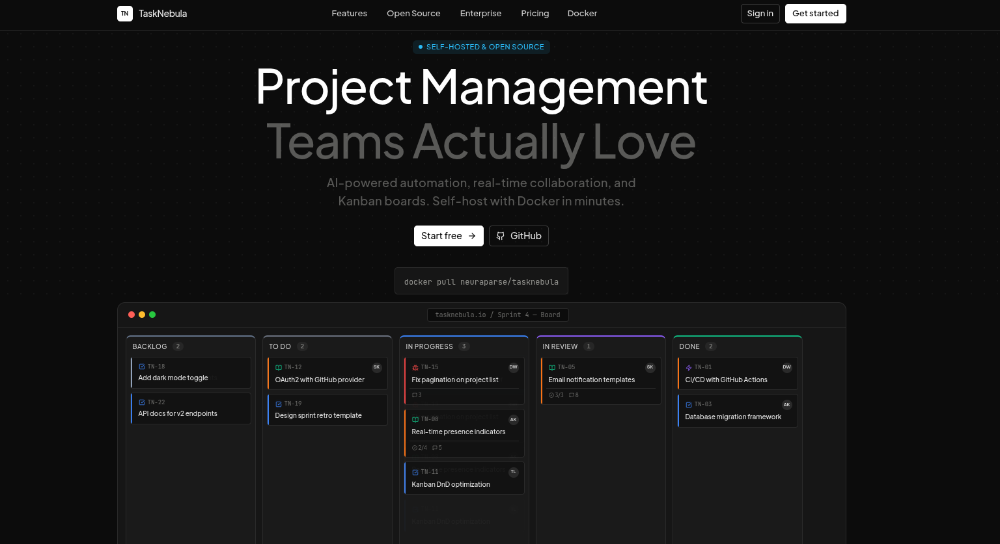
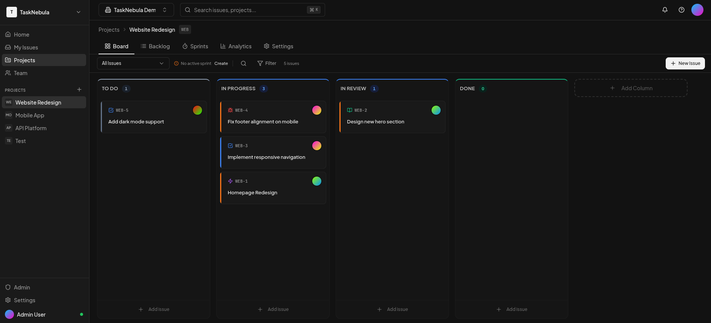
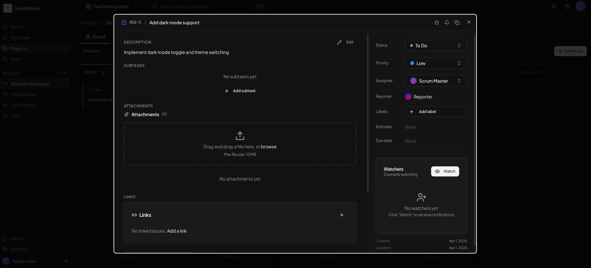
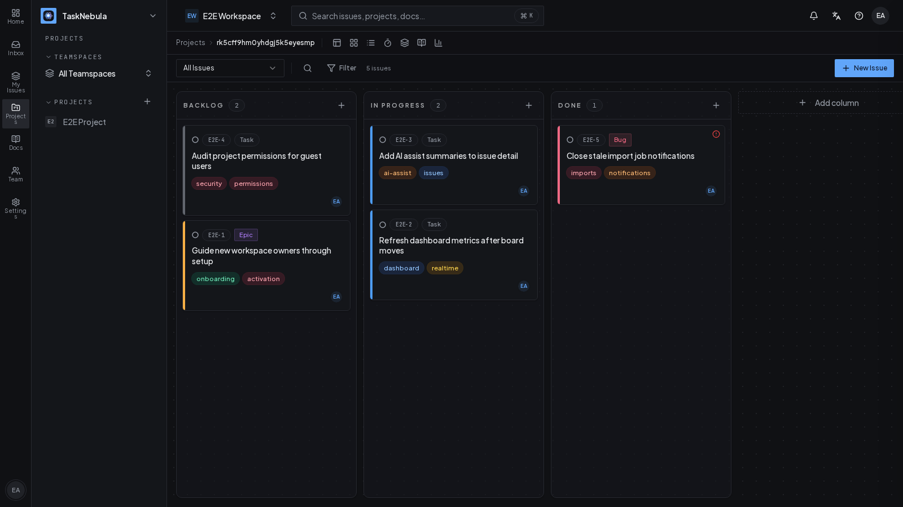
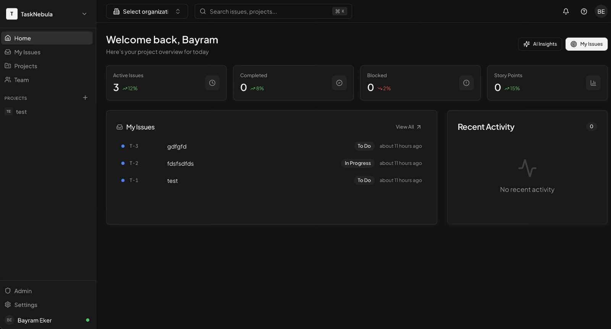

<div align="center">

# TaskNebula

### The open-source project management system with a real AI copilot

[](https://hub.docker.com/r/neuraparse/tasknebula)
[](https://hub.docker.com/r/neuraparse/tasknebula/tags)
[](https://nextjs.org/)
[](https://www.typescriptlang.org/)
[](https://www.postgresql.org/)
[](LICENSE)

A self-hosted issue tracker that feels like Linear, scales like Jira, and
drafts work with you like a pair programmer. Bring your own OpenAI /
Anthropic key — or run fully offline with the native planner.

[Docker Hub](https://hub.docker.com/r/neuraparse/tasknebula) ·
[Quick start](#quick-start) ·
[AI](#ai-assistant-and-agents) ·
[Features](#features) ·
[Report a bug](https://github.com/neuraparse/tasknebula/issues)

<br/>



<table>
<tr>
<td width="50%">

<p align="center"><b>Draft issues from a prompt</b></p>
</td>
<td width="50%">

<p align="center"><b>Per-issue AI assist</b></p>
</td>
</tr>
<tr>
<td width="50%">

<p align="center"><b>Real-time Kanban board</b></p>
</td>
<td width="50%">

<p align="center"><b>Workspace dashboard</b></p>
</td>
</tr>
</table>

</div>

---

## Quick start

One curl, then open your browser:

```bash
curl -fsSL https://raw.githubusercontent.com/neuraparse/tasknebula/main/scripts/quickstart.sh | bash
```

The script pulls `neuraparse/tasknebula:latest`, spins up Postgres, Redis
and LiveKit via Docker Compose, generates strong `AUTH_SECRET` and
`REDIS_PASSWORD` values, and opens **http://localhost:3000**. First-run
wizard creates your admin account.

<details>
<summary>Build from source instead</summary>

```bash
git clone https://github.com/neuraparse/tasknebula.git
cd tasknebula
cp .env.example .env
AUTH_SECRET="$(openssl rand -base64 32)"
REDIS_PASSWORD="$(openssl rand -hex 32)"
sed -i "s|^AUTH_SECRET=.*|AUTH_SECRET=${AUTH_SECRET}|" .env
sed -i "s|^REDIS_PASSWORD=.*|REDIS_PASSWORD=${REDIS_PASSWORD}|" .env
docker compose up -d --build
```

</details>

<details>
<summary>Pin a specific version</summary>

```bash
# default is :latest
TASKNEBULA_IMAGE=neuraparse/tasknebula:0.2.4 docker compose up -d
```

Release notes live on the [GitHub releases page](https://github.com/neuraparse/tasknebula/releases).

</details>

---

## AI assistant and agents

AI is **off by default**. Enable it per workspace from Settings → AI &
Agents in under 30 seconds. Everything is DB-managed — no env vars to
redeploy when you rotate a key.

### What you can do

| Feature              | Where                                        | What it does                                                                                                                                                                 |
| -------------------- | -------------------------------------------- | ---------------------------------------------------------------------------------------------------------------------------------------------------------------------------- |
| **Draft-with-AI**    | Backlog → _Draft with AI_                    | Type one prompt, the LLM decides whether it's one ticket or a whole checklist and returns structured, editable drafts. Select which to create in bulk.                       |
| **Per-issue assist** | Issue detail sidebar → _AI assist_           | Summarise an issue with its comments, rewrite the description, suggest next steps, or propose labels. One click to Apply — no copy-paste.                                    |
| **Native fallback**  | Built-in                                     | If no LLM credential is configured, TaskNebula still ships a deterministic heuristic planner so the buttons are never dead.                                                  |
| **Platform keys**    | Admin → Agent control                        | Super-admins drop in an OpenAI / Anthropic key that all workspaces fall back to. AES-256-GCM encrypted, redacted previews, audit-logged rotations.                           |
| **Workspace keys**   | Settings → AI & Agents → Quick setup         | Each workspace can override the platform default with its own key. Single Quick-Setup button writes provider + model + key + toggle in one transaction.                      |
| **Model profiles**   | Settings → AI & Agents → Your model profiles | Save reusable provider+model+tuning combos (temperature, max tokens, reasoning effort) with full revision history. Saved profiles appear inline in the Quick Setup dropdown. |

### Supported providers & models

| Provider      | Models out of the box                                                                                                     |
| ------------- | ------------------------------------------------------------------------------------------------------------------------- |
| **OpenAI**    | `gpt-4o`, `gpt-4o-mini`, `gpt-4-turbo`, `gpt-4`, `gpt-3.5-turbo`, `o1`, `o1-mini`, plus the speculative `gpt-5.x` family  |
| **Anthropic** | `claude-opus-4-7`, `claude-sonnet-4-6`, `claude-haiku-4-5`, plus `claude-3-5-sonnet`, `claude-3-5-haiku`, `claude-3-opus` |
| **Native**    | Built-in heuristic planner (no API calls)                                                                                 |

### Fails gracefully

Every failure — bad key, rate limit, model not available — becomes an
**in-app notification** with a Sparkles/Bot icon, a one-line action hint
("Open Settings → AI & Agents to add a key"), and a deep-link straight to
the relevant project AI settings. Full audit trail in
`Admin → Audit logs`.

---

## What's new in May 2026

The 2026.05 roadmap merge introduced 34 features in a single push.

**Localization and UX**

- Turkish, German, Spanish, and English locales via `next-intl`.
- View transitions across route changes; glass surfaces on a zinc-950 base.
- Cmd+K omnibar rebuilt with facet chips and an `Ask AI` tab.

**Workflow**

- Initiatives and sub-initiatives with rollup status.
- Native time tracking — estimate, actual, and AI-suggested time.
- Cycle auto-rollover for unfinished work.
- Smart inbox and catch-me-up digest.
- Public intake forms (Linear Asks pattern).
- Importers for Linear, Jira, GitHub Issues, and CSV.

**Collaboration**

- Tiptap and Yjs collaborative issue descriptions.
- Slack integration: slash commands, emoji triage, thread sync.

**Identity and trust**

- SAML SSO and SCIM 2.0 scaffolding.
- Trust center with SIEM streaming (Splunk, Datadog, OpenSearch).
- EU AI Act Article 50 disclosure UI and per-model cards.

**AI and automation**

- Agent-as-assignee with the Linear Agent Protocol.
- Standup agent and stale-issue janitor (cron-driven AI).
- Zod validator middleware for typed request handling.
- Native charts dashboard (Tremor + Recharts) with AI-generated insights.

See the [CHANGELOG](CHANGELOG.md) for the complete list.

---

## Features

<table>
<tr>
<td width="33%" valign="top">

### Project management

- Kanban board with drag-and-drop
- Stories, tasks, bugs, epics, subtasks
- Sprints, burndown, velocity, **auto-rollover**
- Custom fields, issue links, attachments
- Custom workflows, transition rules
- Backlog grooming + roadmap view
- **Initiatives** + sub-initiatives + updates
- **Time tracking**: estimate + actual + AI-suggest
- **Importers**: Linear · Jira · GitHub · CSV

</td>
<td width="33%" valign="top">

### Collaboration

- Real-time presence & live activity feed
- @mentions, watchers, reactions
- **Tiptap + Yjs** collaborative editing
- Threaded comments, email digests
- LiveKit voice rooms for ad-hoc calls
- Project-scoped chat + issue threads
- In-app notification bell with deep-links
- **Smart inbox** + catch-me-up digest
- **Slack** integration (slash + emoji triage)

</td>
<td width="33%" valign="top">

### Admin & governance

- 30+ granular permission types
- Role-based access + issue security levels
- 63+ audit-log action types
- API keys + signed webhooks (HMAC)
- OAuth (GitHub / Google / custom)
- **SAML SSO + SCIM 2.0** scaffolding
- **Trust center** + SIEM streaming
- **EU AI Act Article 50** disclosures
- Multi-org, per-org plan + feature flags

</td>
</tr>
<tr>
<td valign="top">

### AI (opt-in)

- Draft-with-AI (auto single/multi)
- Per-issue summarise / rewrite / suggest
- **Agent-as-assignee** (Linear Agent Protocol)
- **Standup agent + janitor** (cron AI)
- **AI workspace bootstrapper**
- Platform + workspace credential chain
- Saved model profiles w/ revisions
- OpenAI + Anthropic first-class
- Failure → notification w/ action hint

</td>
<td valign="top">

### Analytics

- Burndown, velocity, **cycle time**
- Throughput + lead-time distributions
- Project health scorecard
- **Native charts** (Tremor + Recharts)
- **AI-generated insights** on dashboards
- **Time-in-status** history per issue
- CSV / JSON export
- Sprint retrospectives view
- Cross-project rollups

</td>
<td valign="top">

### Developer experience

- **Cmd+K omnibar** + facet chips + Ask AI
- Keyboard shortcuts everywhere
- Dark mode + mobile responsive
- **i18n**: TR · DE · ES · EN
- **View transitions** for route morphs
- Route-level skeletons (no blank loads)
- SSE-based real-time sync
- One-command production deploy
- **Reverse-proxy clean** out of the box

</td>
</tr>
</table>

---

## Mobile app (roadmap)

A first-class mobile companion is on the roadmap. The plan is to **reuse
the existing TaskNebula API surface** rather than fork it — so every
feature you ship on web instantly becomes available to the app.

### Stack

- **Runtime:** React Native + Expo SDK 52+ (managed workflow; bare only
  if we need native bridges)
- **UI:** Tamagui (atomic, shared theme tokens with Tailwind on web)
- **State:** TanStack Query (same as web; cache mirroring just works)
- **Realtime:** EventSource polyfill for SSE + LiveKit React-Native SDK
  for voice rooms
- **Storage:** MMKV for cache + secure-store for auth tokens
- **Push:** Expo Push (APNs + FCM); server adds a `mobile_devices` table
  and an opt-in toggle in Settings → Notifications

### Phased scope

| Phase                            | Surface                                                                       | Notes                                                                                                                          |
| -------------------------------- | ----------------------------------------------------------------------------- | ------------------------------------------------------------------------------------------------------------------------------ |
| **M1 — Read & Triage**           | Inbox · My issues · Issue detail · Comments                                   | Read-mostly first to validate the API + auth flow on device. Native swipe-to-archive maps to the existing smart-inbox actions. |
| **M2 — Author**                  | New issue · Edit description · Attach photo/voice · Status & assignee changes | Reuses existing draft-with-AI endpoint; photo capture uploads to the same `/api/attachments`.                                  |
| **M3 — Standup & notifications** | Push notifications · Standup card · Catch-me-up digest                        | Server-side templates already exist for digest emails; mobile reuses the JSON variant.                                         |
| **M4 — Realtime collab**         | LiveKit calls · Yjs presence indicators                                       | Read-only Yjs presence in M3, full collaborative editing parity in M4 once the bridge stabilises.                              |
| **M5 — Offline-first**           | Local-first cache with background sync · Conflict resolution                  | Drop the optimistic-update guards from web back into the shared TanStack layer.                                                |

### Auth on device

Mobile won't use cookie-based Auth.js sessions — instead the
`/api/auth/mobile/exchange` endpoint (to be added) returns a long-lived
**refresh token** + short-lived **access token** after the same
credentials / OAuth / SAML flow. The web session remains the authoritative
identity store; mobile devices show up in **Settings → Sessions** for
remote revocation.

### Repo layout

A mobile app would live at `apps/mobile/` as a sibling to `apps/web/`,
sharing types from `packages/types`. No code change is required to the
existing Next.js app — every endpoint already returns clean JSON.

### Help wanted

Mobile development is community-driven for now. If you'd like to take the
lead on M1, open a [discussion](https://github.com/neuraparse/tasknebula/discussions).

---

## Tech stack

<table>
<tr>
<td width="50%" valign="top">

**Frontend**

- Next.js 15 (App Router, RSC)
- React 19
- Tailwind CSS + shadcn/ui
- TanStack Query for client state
- SSE for realtime fan-out

</td>
<td width="50%" valign="top">

**Backend**

- Next.js API routes
- Drizzle ORM
- PostgreSQL 16 + `pgvector`
- Redis 7 for cache + presence
- LiveKit for voice rooms
- Auth.js v5 (NextAuth)

</td>
</tr>
</table>

---

## Production

```env
# .env
APP_URL=https://tasks.yourcompany.com
AUTH_SECRET=your-secret-here   # openssl rand -base64 32
```

Put any reverse proxy in front for SSL. Caddy is the easiest:

```caddy
tasks.yourcompany.com {
    reverse_proxy localhost:3000
}
```

See [.env.example](.env.example) for the full list — SMTP, OAuth, LiveKit
tuning, optional platform LLM keys, etc. Everything AI-related can be
configured through the UI **after** first boot; env vars are only a
fallback for dev.

### Voice rooms behind HTTPS

LiveKit ships plain `ws://` on port 7880. A production browser loading
TaskNebula over `https://` refuses mixed-content `wss://` without TLS in
front. Put nginx (or Caddy) on its own subdomain:

1. **DNS**: add `livekit.your-domain.example.com` → same server IP as the app.
2. **nginx**: copy the ready template at
   [`nginx/tasknebula-livekit.conf`](nginx/tasknebula-livekit.conf),
   replace the hostname, then:
   ```bash
   sudo certbot --nginx -d livekit.your-domain.example.com
   sudo nginx -t && sudo nginx -s reload
   ```
3. **.env**:
   ```env
   NEXT_PUBLIC_LIVEKIT_URL=wss://livekit.your-domain.example.com
   ```
4. **Rebuild** so the build-time env is baked into the Next bundle:
   ```bash
   docker compose up -d --build web
   ```

The template terminates TLS, forwards to `127.0.0.1:7880`, and keeps the
WebSocket upgrade headers + 24h idle timeout LiveKit needs.

---

## Commands

```bash
docker compose up -d                  # Start (pulls :latest)
docker compose down                   # Stop
docker compose logs -f web            # Tail the web service
docker compose pull web && \
  docker compose up -d                # Update to the newest image
docker compose up -d --build          # Rebuild from local source
git pull && docker compose up -d --build   # Pull + rebuild
```

> `docker-compose.yml` defaults to `image: neuraparse/tasknebula:latest`.
> Set `TASKNEBULA_IMAGE=neuraparse/tasknebula:0.2.4` in `.env` to pin.

---

## Development

```bash
pnpm install
docker compose up -d postgres redis
cp .env.example .env
cp apps/web/.env.example apps/web/.env.local
cd packages/db && pnpm tsx scripts/migrate.ts && cd ../..
pnpm dev
```

Run the full test suite:

```bash
pnpm --filter @tasknebula/web exec jest
```

AI-related tests live under `apps/web/src/lib/ai/__tests__`,
`apps/web/src/lib/agents/__tests__`, and
`apps/web/src/app/api/ai/**/__tests__`.

---

## Contributing

Pull requests welcome. See [CONTRIBUTING.md](CONTRIBUTING.md) for the
branch model, commit conventions, and how to run the linter + tests
locally before pushing.

## License

MIT — see [LICENSE](LICENSE).

---

<div align="center">

Built by [Neura Parse](https://neuraparse.com) · Powered by open source

</div>
