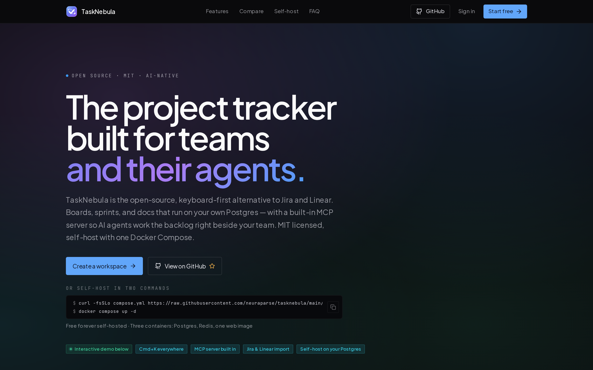
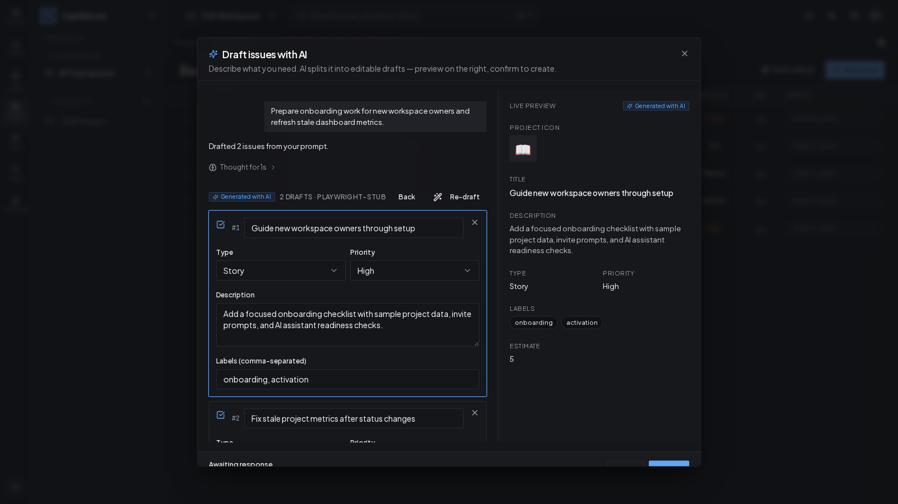
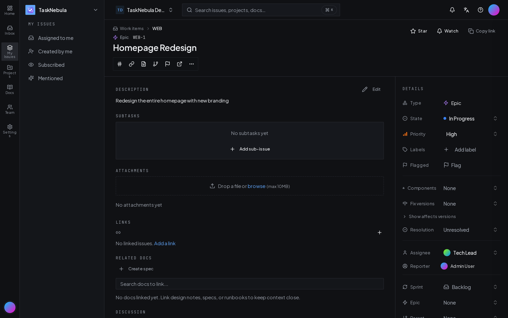
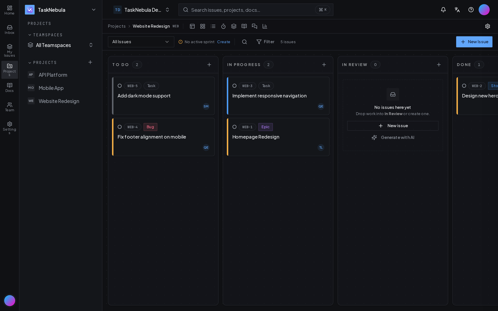
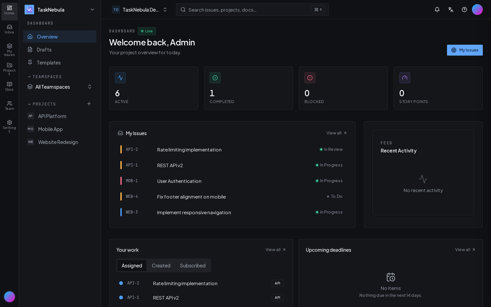
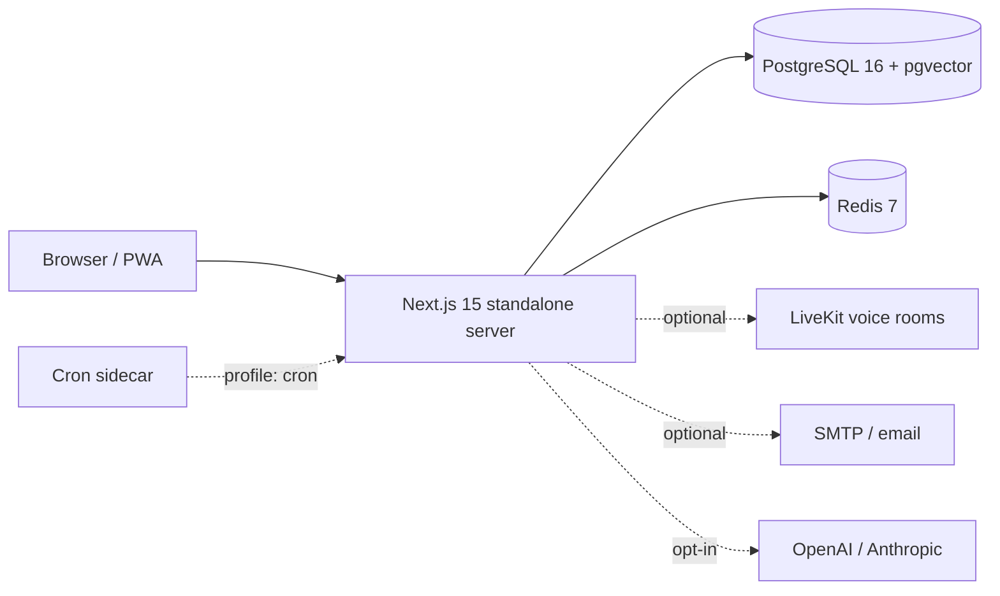

<div align="center">

# TaskNebula

### AI-native project management that you can run in one Docker command

[](https://hub.docker.com/r/neuraparse/tasknebula)
[](https://hub.docker.com/r/neuraparse/tasknebula/tags)
[](https://hub.docker.com/r/neuraparse/tasknebula/tags)
[](#docker-image)
[](https://nextjs.org/)
[](https://www.typescriptlang.org/)
[](https://www.postgresql.org/)
[](LICENSE)

A self-hosted issue tracker that feels like Linear, scales like Jira, and
ships with a real AI copilot. Bring your own OpenAI / Anthropic key, keep
AI disabled by default, or run fully offline with the native planner.

<p>
  <a href="#quick-start"></a>
  <a href="#2-docker-desktop-local-install"></a>
  <a href="https://hub.docker.com/r/neuraparse/tasknebula"></a>
  <a href="https://raw.githubusercontent.com/neuraparse/tasknebula/main/docker-compose.yml"></a>
</p>

[Quick start](#quick-start) ·
[Docker image](#docker-image) ·
[Architecture](#architecture) ·
[AI](#ai-assistant-and-agents) ·
[Features](#features) ·
[Production](#production) ·
[Report a bug](https://github.com/neuraparse/tasknebula/issues)

<br/>



<table>
<tr>
<td width="50%">

<p align="center"><b>Draft issues from a prompt</b></p>
</td>
<td width="50%">

<p align="center"><b>Rich issue detail — labels, versions, components, sub-issues</b></p>
</td>
</tr>
<tr>
<td width="50%">

<p align="center"><b>Real-time Kanban board</b></p>
</td>
<td width="50%">

<p align="center"><b>Workspace dashboard</b></p>
</td>
</tr>
</table>

</div>

---

## Quick start

Pick the path that matches where you are deploying.

| Path                   | Best for                                            | Command / link                                                                                                                            |
| ---------------------- | --------------------------------------------------- | ----------------------------------------------------------------------------------------------------------------------------------------- |
| **One-command Docker** | A fresh Linux VM or homelab box                     | `curl -fsSL https://raw.githubusercontent.com/neuraparse/tasknebula/main/scripts/quickstart.sh \| bash`                                   |
| **Docker Desktop**     | Local Mac, Windows, or Linux PC with Docker Desktop | `curl -fsSLo compose.yml https://raw.githubusercontent.com/neuraparse/tasknebula/main/docker-compose.desktop.yml && docker compose up -d` |
| **Pinned production**  | Repeatable self-hosted releases                     | `TASKNEBULA_IMAGE=neuraparse/tasknebula:0.6.9 docker compose up -d`                                                                       |
| **Source build**       | Local development or patching                       | `docker compose up -d --build`                                                                                                            |

> 2026 note: Play with Docker is intentionally removed. Docker's
> [community announcement](https://forums.docker.com/t/play-with-docker-is-deprecated-and-will-be-unavailable-starting-march-1-2026-learn-about-alternatives/151177)
> says hosted Play with Docker was discontinued on March 1, 2026. Docker's
> current [Compose install docs](https://docs.docker.com/compose/install/)
> recommend Docker Desktop because it includes Docker Engine, Docker CLI, and
> Docker Compose.

### 1. One-command install

The install script clones the repo if needed, provisions `.env`, generates
strong `AUTH_SECRET` and `REDIS_PASSWORD` values, pulls the published image,
and waits until the web container is healthy.

```bash
curl -fsSL https://raw.githubusercontent.com/neuraparse/tasknebula/main/scripts/quickstart.sh | bash
```

Open **http://localhost:3000** and finish the first-run admin wizard.

### 2. Docker Desktop local install

Docker Desktop is the shortest path for a local PC demo in 2026. It ships
Docker Engine, Docker CLI, and Docker Compose together, so you only need to
download the standalone desktop Compose file and start it.

macOS / Linux / WSL:

```bash
mkdir -p tasknebula && cd tasknebula
curl -fsSLo compose.yml https://raw.githubusercontent.com/neuraparse/tasknebula/main/docker-compose.desktop.yml
docker compose up -d
```

Windows PowerShell:

```powershell
New-Item -ItemType Directory -Force tasknebula
Set-Location tasknebula
Invoke-WebRequest https://raw.githubusercontent.com/neuraparse/tasknebula/main/docker-compose.desktop.yml -OutFile compose.yml
docker compose up -d
```

Open **http://localhost:3000** and finish the first-run admin wizard. This
desktop file uses local-only demo secrets and binds the web app to
`127.0.0.1:3000`; use the server install below for anything internet-facing.

### 3. Manual server install

```bash
git clone https://github.com/neuraparse/tasknebula.git
cd tasknebula
cp .env.example .env
AUTH_SECRET="$(openssl rand -base64 32)"
REDIS_PASSWORD="$(openssl rand -hex 32)"
sed -i "s|^AUTH_SECRET=.*|AUTH_SECRET=${AUTH_SECRET}|" .env
sed -i "s|^REDIS_PASSWORD=.*|REDIS_PASSWORD=${REDIS_PASSWORD}|" .env
docker compose up -d
```

### Update, pin, or rebuild

```bash
docker compose pull web && docker compose up -d    # update published image
TASKNEBULA_IMAGE=neuraparse/tasknebula:0.6.9 \
  docker compose up -d                             # pin a release
docker compose up -d --build                       # build local source
docker compose --profile cron up -d cron           # enable optional cron sidecar
```

Release notes live on the
[GitHub releases page](https://github.com/neuraparse/tasknebula/releases).

---

## Docker image

| Item              | Value                                                                                                          |
| ----------------- | -------------------------------------------------------------------------------------------------------------- |
| Repository        | [`neuraparse/tasknebula`](https://hub.docker.com/r/neuraparse/tasknebula)                                      |
| Recommended tag   | `0.6.9` for pinned installs, `latest` for quickstart demos                                                     |
| Current platform  | `linux/amd64`                                                                                                  |
| Runtime port      | `3000`                                                                                                         |
| Health endpoint   | `GET /api/health`                                                                                              |
| Required services | PostgreSQL 16 + `pgvector`, Redis 7                                                                            |
| Optional services | LiveKit voice rooms, cron sidecar, SMTP, OAuth providers, OpenAI / Anthropic keys                              |
| Immutable pulls   | Inspect the tag digest with `docker buildx imagetools inspect neuraparse/tasknebula:0.6.9` before pinning hard |

The production Compose file keeps core services always-on and gates optional
automation behind Docker Compose profiles. This keeps `docker compose up -d`
safe for first-time users while still letting operators enable scheduled
agents with `--profile cron`.

---

## Architecture


```mermaid
flowchart LR
  Browser[Browser / PWA] --> Web[Next.js 15 standalone server]
  Web --> Postgres[(PostgreSQL 16 + pgvector)]
  Web --> Redis[(Redis 7)]
  Web -. optional .-> LiveKit[LiveKit voice rooms]
  Web -. optional .-> SMTP[SMTP / email]
  Web -. opt-in .-> LLM[OpenAI / Anthropic]
  Cron[Cron sidecar] -. profile: cron .-> Web
```

**2026 self-hosting defaults**

- Published Docker image first; local source builds stay available.
- Non-root runtime container with Next.js standalone output.
- Healthchecks for web, Postgres, Redis, and LiveKit.
- Localhost-bound ports by default in production Compose.
- Optional cron and collaboration services are explicit, not surprise-on.
- AI credentials are DB-managed from the admin UI; env vars are fallback only.

---

## AI assistant and agents

AI is **off by default**. Enable it per workspace from Settings → AI &
Agents in under 30 seconds. Everything is DB-managed — no env vars to
redeploy when you rotate a key.

### What you can do

| Feature              | Where                                        | What it does                                                                                                                                                                 |
| -------------------- | -------------------------------------------- | ---------------------------------------------------------------------------------------------------------------------------------------------------------------------------- |
| **Draft-with-AI**    | Backlog → _Draft with AI_                    | Type one prompt, the LLM decides whether it's one ticket or a whole checklist and returns structured, editable drafts. Select which to create in bulk.                       |
| **Per-issue assist** | Issue detail sidebar → _AI assist_           | Summarise an issue with its comments, rewrite the description, suggest next steps, or propose labels. One click to Apply — no copy-paste.                                    |
| **Native fallback**  | Built-in                                     | If no LLM credential is configured, TaskNebula still ships a deterministic heuristic planner so the buttons are never dead.                                                  |
| **Platform keys**    | Admin → Agent control                        | Super-admins drop in an OpenAI / Anthropic key that all workspaces fall back to. AES-256-GCM encrypted, redacted previews, audit-logged rotations.                           |
| **Workspace keys**   | Settings → AI & Agents → Quick setup         | Each workspace can override the platform default with its own key. Single Quick-Setup button writes provider + model + key + toggle in one transaction.                      |
| **Model profiles**   | Settings → AI & Agents → Your model profiles | Save reusable provider+model+tuning combos (temperature, max tokens, reasoning effort) with full revision history. Saved profiles appear inline in the Quick Setup dropdown. |

### Supported providers & models

| Provider      | Models out of the box                                                                                                           |
| ------------- | ------------------------------------------------------------------------------------------------------------------------------- |
| **OpenAI**    | `gpt-4o`, `gpt-4o-mini`, `gpt-4-turbo`, `gpt-4`, `gpt-3.5-turbo`, `o1`, `o1-mini`, plus the speculative `gpt-5.x` family        |
| **Anthropic** | `claude-fable-5`, `claude-opus-4-8`, `claude-opus-4-7`, `claude-sonnet-4-6`, `claude-haiku-4-5` (defaults to `claude-opus-4-8`) |
| **Native**    | Built-in heuristic planner (no API calls)                                                                                       |

### Fails gracefully

Every failure — bad key, rate limit, model not available — becomes an
**in-app notification** with a Sparkles/Bot icon, a one-line action hint
("Open Settings → AI & Agents to add a key"), and a deep-link straight to
the relevant project AI settings. Full audit trail in
`Admin → Audit logs`.

---

## What's new

Latest release: **v0.6.9**. Highlights from the recent line — see the
[CHANGELOG](CHANGELOG.md) for the complete history:

- **30-language internationalization.** The entire authenticated app is
  localized via `next-intl` (~3,900 strings across 55 namespaces) with
  device/browser auto-detection and a native-name language switcher; Arabic
  and Hebrew render right-to-left.
- **Jira-parity work graph.** First-class **labels**, project
  **versions/releases**, **components**, and a **resolution** model (plus
  `flagged`) landed as one coherent schema wave (migration `0054`).
- **Refreshed AI model catalog.** Current Anthropic lineup — Claude Opus 4.8
  (default), Fable 5, Opus 4.7, Sonnet 4.6, Haiku 4.5 — with correct output
  limits and reasoning-effort options.
- **Inline type-to-create pickers** for sprints, epics, and sub-issues, more
  Jira/Plane-parity issue-detail fields, and an admin version-update banner.
- **Light/dark theming fix.** Modals, the Cmd+K palette, and popovers are now
  legible in day mode (theme-aware surfaces) with no dark-mode regression.

---

## Languages

TaskNebula ships **30 languages** out of the box. On a visitor's first load the
app auto-selects their language from the browser/device (`Accept-Language`,
quality-weighted with regional → base fallback) and persists it; they can switch
any time from the in-app language picker, which lists every locale by its native
name. An explicit choice always wins over auto-detection.

> English · Türkçe · Deutsch · Español · Français · Italiano · Português ·
> Nederlands · Polski · Русский · Українська · Čeština · Svenska · Dansk · Suomi ·
> Norsk Bokmål · Română · Magyar · Ελληνικά · Български · 简体中文 · 繁體中文 ·
> 日本語 · 한국어 · हिन्दी · Bahasa Indonesia · ไทย · Tiếng Việt · العربية · עברית

- **Right-to-left** layout for Arabic and Hebrew (Radix `DirectionProvider`).
- **Zero hardcoded strings**: every user-facing string goes through `next-intl`;
  a lint gate (`react/jsx-no-literals`) blocks new hardcoded text, and all 30
  catalogs are key-parity verified (`node scripts/i18n-check.mjs`).
- Add or change a locale in `apps/web/src/lib/i18n/config.ts` +
  `apps/web/messages/<locale>.json`. The marketing landing page is intentionally
  English-only.

---

## Features

<table>
<tr>
<td width="33%" valign="top">

### Project management

- Kanban board with drag-and-drop
- Stories, tasks, bugs, epics, subtasks
- Sprints, burndown, velocity, **auto-rollover**
- Custom fields, issue links, attachments
- Custom workflows, transition rules
- Backlog grooming + roadmap view
- **Initiatives** + sub-initiatives + updates
- **Time tracking**: estimate + actual + AI-suggest
- **Importers**: Linear · Jira · GitHub · CSV

</td>
<td width="33%" valign="top">

### Collaboration

- Real-time presence & live activity feed
- @mentions, watchers, reactions
- **Tiptap + Yjs** collaborative editing
- Threaded comments, email digests
- LiveKit voice rooms for ad-hoc calls
- Project-scoped chat + issue threads
- In-app notification bell with deep-links
- **Smart inbox** + catch-me-up digest
- **Slack** integration (slash + emoji triage)

</td>
<td width="33%" valign="top">

### Admin & governance

- 30+ granular permission types
- Role-based access + issue security levels
- 63+ audit-log action types
- API keys + signed webhooks (HMAC)
- OAuth (GitHub / Google / custom)
- **SAML SSO + SCIM 2.0** scaffolding
- **Trust center** + SIEM streaming
- **EU AI Act Article 50** disclosures
- Multi-org, per-org plan + feature flags

</td>
</tr>
<tr>
<td valign="top">

### AI (opt-in)

- Draft-with-AI (auto single/multi)
- Per-issue summarise / rewrite / suggest
- **Agent-as-assignee** (Linear Agent Protocol)
- **Standup agent + janitor** (cron AI)
- **AI workspace bootstrapper**
- Platform + workspace credential chain
- Saved model profiles w/ revisions
- OpenAI + Anthropic first-class
- Failure → notification w/ action hint

</td>
<td valign="top">

### Analytics

- Burndown, velocity, **cycle time**
- Throughput + lead-time distributions
- Project health scorecard
- **Native charts** (Recharts)
- **AI-generated insights** on dashboards
- **Time-in-status** history per issue
- CSV / JSON export
- Sprint retrospectives view
- Cross-project rollups

</td>
<td valign="top">

### Developer experience

- **Cmd+K omnibar** + facet chips + Ask AI
- Keyboard shortcuts everywhere
- Dark mode + mobile responsive
- **i18n**: 30 languages, auto-detected
- Route-level skeletons and polished loading states
- SSE-based real-time sync
- One-command production deploy
- **Reverse-proxy clean** out of the box

</td>
</tr>
</table>

---

## Mobile app

A native **iOS and Android** app for TaskNebula is on the way. It connects to
your self-hosted server — you point it at your instance URL and sign in.

> The mobile app will be **free and available to everyone**. Its source code is
> **not part of this open-source repository** and is not published here.

---

## Roadmap

Per-item detail and status live in
[`docs/ROADMAP_2026.md`](docs/ROADMAP_2026.md). Near-term focus:

**Q3 2026 — Work-graph foundations**

- Finish the Jira-parity layer UI (labels, components, versions/releases)
  already shipped at the schema level.
- Manual issue ranking (drag order) and enforced workflow transitions.
- First-class **boards** (multiple boards per project, WIP limits, swimlanes)
  and **JQL v2** saved filters.
- Notification schemes with watcher / @mention / digest fan-out.
- Platform hardening: tenant isolation (Postgres RLS, phase 1),
  **API-key auth + scopes** (also un-breaks the MCP server), and pagination
  for 10k+ issues.

**Q4 2026 — Developer workflow + AI-native**

- Deep **GitHub / GitLab** integration (branch / PR / commit ↔ issue,
  auto-transitions on merge).
- **Jira / Linear importer v2** (comments, attachments, hierarchy, custom
  fields).
- AI triage auto-apply + duplicate surfacing; semantic search and Ask-AI
  last mile.
- Agent approval queue + AI governance; **MCP server v2** (npm-published,
  OAuth 2.1).
- Auth hardening: OAuth DB adapter fix, 2FA / passkeys, session revocation.

**Mobile** — a native iOS/Android client for self-hosted instances (see
above) is in progress.

---

## Tech stack

<table>
<tr>
<td width="50%" valign="top">

**Frontend**

- Next.js 15 (App Router, RSC)
- React 19
- Tailwind CSS + shadcn/ui
- TanStack Query for client state
- SSE for realtime fan-out

</td>
<td width="50%" valign="top">

**Backend**

- Next.js API routes
- Drizzle ORM
- PostgreSQL 16 + `pgvector`
- Redis 7 for cache + presence
- LiveKit for voice rooms
- Auth.js v5 (NextAuth)

</td>
</tr>
</table>

---

## Production

TaskNebula is designed for a small, boring production surface: one web
container, Postgres, Redis, optional LiveKit, and your reverse proxy.

### Minimum production env

```bash
cp .env.example .env

AUTH_SECRET="$(openssl rand -base64 32)"
REDIS_PASSWORD="$(openssl rand -hex 32)"
LIVEKIT_API_SECRET="$(openssl rand -hex 32)"

sed -i "s|^APP_URL=.*|APP_URL=https://tasks.yourcompany.com|" .env
sed -i "s|^AUTH_SECRET=.*|AUTH_SECRET=${AUTH_SECRET}|" .env
sed -i "s|^REDIS_PASSWORD=.*|REDIS_PASSWORD=${REDIS_PASSWORD}|" .env
sed -i "s|^LIVEKIT_API_SECRET=.*|LIVEKIT_API_SECRET=${LIVEKIT_API_SECRET}|" .env
```

Then start the stack:

```bash
TASKNEBULA_IMAGE=neuraparse/tasknebula:0.6.9 docker compose up -d
```

### Reverse proxy

Put TLS in front of the localhost-bound web port. Caddy is the smallest
working example:

```caddy
tasks.yourcompany.com {
    reverse_proxy localhost:3000
}
```

See [.env.example](.env.example) for the full list — SMTP, OAuth, LiveKit
tuning, optional platform LLM keys, etc. Everything AI-related can be
configured through the UI **after** first boot; env vars are only a
fallback for dev.

### Production checklist

| Area         | Recommendation                                                                  |
| ------------ | ------------------------------------------------------------------------------- |
| Image        | Pin `TASKNEBULA_IMAGE=neuraparse/tasknebula:0.6.9`; use `latest` only for demos |
| Secrets      | Generate `AUTH_SECRET`, `REDIS_PASSWORD`, and `LIVEKIT_API_SECRET` per install  |
| Network      | Keep Compose ports bound to `127.0.0.1`; expose through your reverse proxy      |
| Persistence  | Back up `postgres_data`, `redis_data`, and `uploads_data`                       |
| Updates      | Pull, restart, then verify `/api/health`                                        |
| Automation   | Enable scheduled agents only with `docker compose --profile cron up -d cron`    |
| AI providers | Prefer Admin → Agent control over long-lived env keys                           |

### Voice rooms behind HTTPS

LiveKit ships plain `ws://` on port 7880. A production browser loading
TaskNebula over `https://` refuses mixed-content `wss://` without TLS in
front. Put nginx (or Caddy) on its own subdomain:

1. **DNS**: add `livekit.your-domain.example.com` → same server IP as the app.
2. **nginx**: copy the ready template at
   [`nginx/tasknebula-livekit.conf`](nginx/tasknebula-livekit.conf),
   replace the hostname, then:
   ```bash
   sudo certbot --nginx -d livekit.your-domain.example.com
   sudo nginx -t && sudo nginx -s reload
   ```
3. **.env**:
   ```env
   NEXT_PUBLIC_LIVEKIT_URL=wss://livekit.your-domain.example.com
   ```
4. **Rebuild** so the build-time env is baked into the Next bundle:
   ```bash
   docker compose up -d --build web
   ```

The template terminates TLS, forwards to `127.0.0.1:7880`, and keeps the
WebSocket upgrade headers + 24h idle timeout LiveKit needs.

---

## Operations

| Task                | Command                                                        |
| ------------------- | -------------------------------------------------------------- |
| Start               | `docker compose up -d`                                         |
| Stop                | `docker compose down`                                          |
| Tail web logs       | `docker compose logs -f web`                                   |
| Update image        | `docker compose pull web && docker compose up -d`              |
| Rebuild from source | `docker compose up -d --build`                                 |
| Check containers    | `docker compose ps`                                            |
| Check app health    | `curl -fsS http://localhost:3000/api/health`                   |
| Enable cron sidecar | `docker compose --profile cron up -d cron`                     |
| Inspect image tag   | `docker buildx imagetools inspect neuraparse/tasknebula:0.6.9` |

> `docker-compose.yml` defaults to `image: neuraparse/tasknebula:latest`.
> Set `TASKNEBULA_IMAGE=neuraparse/tasknebula:0.6.9` in `.env` to pin.

---

## Development

```bash
pnpm install
docker compose up -d postgres redis
cp .env.example .env
cp apps/web/.env.example apps/web/.env.local
cd packages/db && pnpm tsx scripts/migrate.ts && cd ../..
pnpm dev
```

Run the full test suite:

```bash
pnpm --filter @tasknebula/web exec jest
```

AI-related tests live under `apps/web/src/lib/ai/__tests__`,
`apps/web/src/lib/agents/__tests__`, and
`apps/web/src/app/api/ai/**/__tests__`.

---

## Contributing

Pull requests welcome. See [CONTRIBUTING.md](CONTRIBUTING.md) for the
branch model, commit conventions, and how to run the linter + tests
locally before pushing.

**AI-assisted contributors:** the repo ships a Claude Code setup —
[`CLAUDE.md`](CLAUDE.md) (project guide, also exposed as `AGENTS.md` for
other tools), plus subagents, slash commands, and path-scoped rules under
[`.claude/`](.claude). Useful commands: `/verify` (type-check + lint +
test), `/ship` (branch + commit + PR), `/db-migrate`, and `/release`.

## Releasing

Maintainers publish versioned images to Docker Hub
(`neuraparse/tasknebula:<version>` + `latest`, `linux/amd64`). The
step-by-step process — version bump, changelog, `docker build`/`push`,
git tag, and GitHub release — is documented in
[docs/RELEASE.md](docs/RELEASE.md).

## License

MIT — see [LICENSE](LICENSE).

---

<div align="center">

Built by [Neura Parse](https://neuraparse.com) · Powered by open source

</div>
