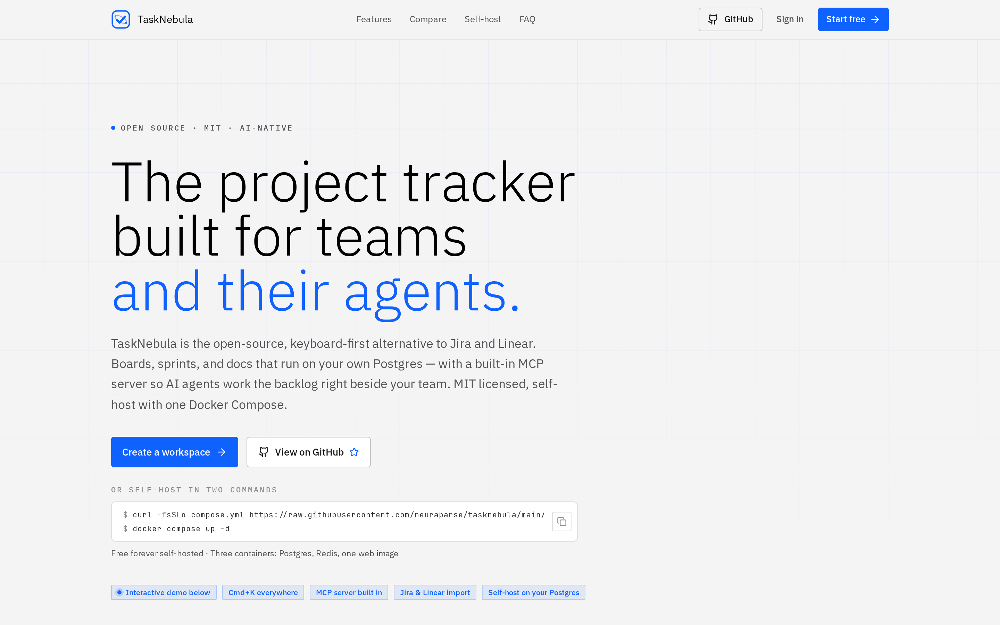
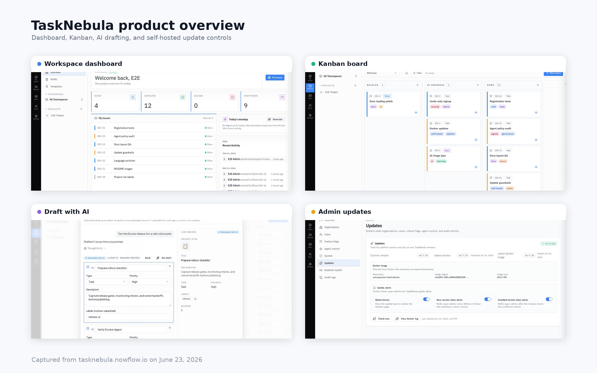

<div align="center">

# TaskNebula

### Self-hosted, AI-native project management in one Docker command

[](https://hub.docker.com/r/neuraparse/tasknebula)
[](https://hub.docker.com/r/neuraparse/tasknebula/tags)
[](#docker-image)
[](https://nextjs.org/)
[](https://www.postgresql.org/)
[](#ai-privacy-and-languages)
[](LICENSE)

TaskNebula is an open-source issue tracker for teams that want Linear-style
speed, Jira-style depth, and optional AI assistance without giving up control
of their data. Run it with Docker, bring your own OpenAI or Anthropic key, or
keep AI disabled and use the built-in native planner.

<p>
  <a href="#quick-start"></a>
  <a href="https://hub.docker.com/r/neuraparse/tasknebula"></a>
  <a href="https://raw.githubusercontent.com/neuraparse/tasknebula/main/docker-compose.yml"></a>
</p>

[Quick start](#quick-start) ·
[Mobile app](#mobile-app-coming-soon) ·
[Features](#features) ·
[Docker image](#docker-image) ·
[Deployment](#deployment) ·
[Docs](#docs)

<br/>



<br/>



</div>

---

## Quick Start

Pick the path that matches where you are deploying.

| Path                   | Best for                         | Command                                                                                                                                   |
| ---------------------- | -------------------------------- | ----------------------------------------------------------------------------------------------------------------------------------------- |
| **One-command Docker** | Fresh Linux VM or homelab server | `curl -fsSL https://raw.githubusercontent.com/neuraparse/tasknebula/main/scripts/quickstart.sh \| bash`                                   |
| **Docker Desktop**     | Local Mac, Windows, or Linux PC  | `curl -fsSLo compose.yml https://raw.githubusercontent.com/neuraparse/tasknebula/main/docker-compose.desktop.yml && docker compose up -d` |
| **Pinned production**  | Repeatable self-hosted releases  | `TASKNEBULA_IMAGE=neuraparse/tasknebula:<tag> docker compose up -d`                                                                       |
| **Source build**       | Local development or patching    | `docker compose up -d --build`                                                                                                            |

After boot, open **http://localhost:3000** and finish the first-run admin
wizard.

### Update Or Pin

```bash
./scripts/tasknebula-backup.sh
docker compose pull web && docker compose up -d

TASKNEBULA_IMAGE=neuraparse/tasknebula:<tag> docker compose up -d
```

For production hardening, reverse proxy setup, LiveKit, SMTP, OAuth, backups,
and self-update details, use [docs/DEPLOYMENT.md](docs/DEPLOYMENT.md).

---

## Features

| Area                   | Highlights                                                                                   |
| ---------------------- | -------------------------------------------------------------------------------------------- |
| **Project management** | Kanban, backlog, sprints, epics, subtasks, custom fields, issue links, attachments, imports  |
| **Collaboration**      | Comments, mentions, watchers, reactions, docs, project chat, presence, email notifications   |
| **AI assistance**      | Draft-with-AI, per-issue assist, native fallback planner, agent activity, approval gates     |
| **Admin & governance** | Multi-org roles, granular permissions, audit logs, registration controls, webhooks, API keys |
| **Analytics**          | Burndown, velocity, cycle time, throughput, project health, time-in-status, dashboard cards  |
| **Self-hosting**       | Docker-first deploy, Postgres, Redis, health checks, optional LiveKit and cron sidecar       |

Importers currently cover **Jira**, **Linear**, **GitHub**, and **CSV**.

---

## AI, Privacy, And Languages

- **AI is opt-in.** Configure workspace or platform keys from the admin UI.
  OpenAI and Anthropic are supported, and the native planner works without an
  external LLM.
- **Self-hosted by default.** Your app, database, Redis, uploads, and optional
  voice server run in your own environment.
- **30 languages included.** Browser/device auto-detection, persisted language
  choice, native-name switching, and RTL support for Arabic and Hebrew are
  built in.

---

## Mobile App Coming Soon

Native mobile apps are on the way. Availability details will be shared when
they are ready.

---

## Docker Image

| Item              | Value                                                                             |
| ----------------- | --------------------------------------------------------------------------------- |
| Repository        | [`neuraparse/tasknebula`](https://hub.docker.com/r/neuraparse/tasknebula)         |
| Recommended tag   | `latest` for demos; use a release tag for repeatable installs                     |
| Platform          | `linux/amd64`                                                                     |
| Runtime port      | `3000`                                                                            |
| Health endpoint   | `GET /api/health`                                                                 |
| Required services | PostgreSQL 16 + `pgvector`, Redis 7                                               |
| Optional services | LiveKit voice rooms, cron sidecar, SMTP, OAuth providers, OpenAI / Anthropic keys |
| Inspect digest    | `docker buildx imagetools inspect neuraparse/tasknebula:<tag>`                    |

---

## Deployment

TaskNebula is designed around a small production surface:

- `web`: Next.js standalone runtime
- `postgres`: PostgreSQL 16 with pgvector
- `redis`: cache, realtime fan-out, and background coordination
- optional `livekit`: voice rooms
- optional `cron`: scheduled standup, janitor, and version-check jobs

Common commands:

```bash
docker compose up -d
docker compose ps
curl -fsS http://localhost:3000/api/health
docker compose logs -f web
```

Use `TASKNEBULA_IMAGE=neuraparse/tasknebula:<tag>` when you want a pinned,
repeatable deployment. Use `latest` only for quick demos.

---

## Docs

| Need                   | Link                                         |
| ---------------------- | -------------------------------------------- |
| Full release history   | [CHANGELOG.md](CHANGELOG.md)                 |
| Deployment guide       | [docs/DEPLOYMENT.md](docs/DEPLOYMENT.md)     |
| Architecture           | [docs/ARCHITECTURE.md](docs/ARCHITECTURE.md) |
| Roadmap                | [docs/ROADMAP_2026.md](docs/ROADMAP_2026.md) |
| Release process        | [docs/RELEASE.md](docs/RELEASE.md)           |
| Contributing           | [CONTRIBUTING.md](CONTRIBUTING.md)           |
| AI agent/project guide | [CLAUDE.md](CLAUDE.md)                       |

---

## Development

```bash
pnpm install
docker compose up -d postgres redis
cp .env.example .env
cp apps/web/.env.example apps/web/.env.local
pnpm db:migrate
pnpm dev
```

Before pushing code, run:

```bash
pnpm type-check
pnpm lint
pnpm test
```

---

## License

MIT. See [LICENSE](LICENSE).

<div align="center">

Built by [Neura Parse](https://neuraparse.com) · Powered by open source

</div>
